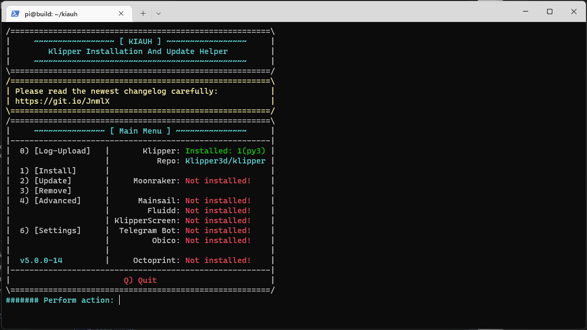
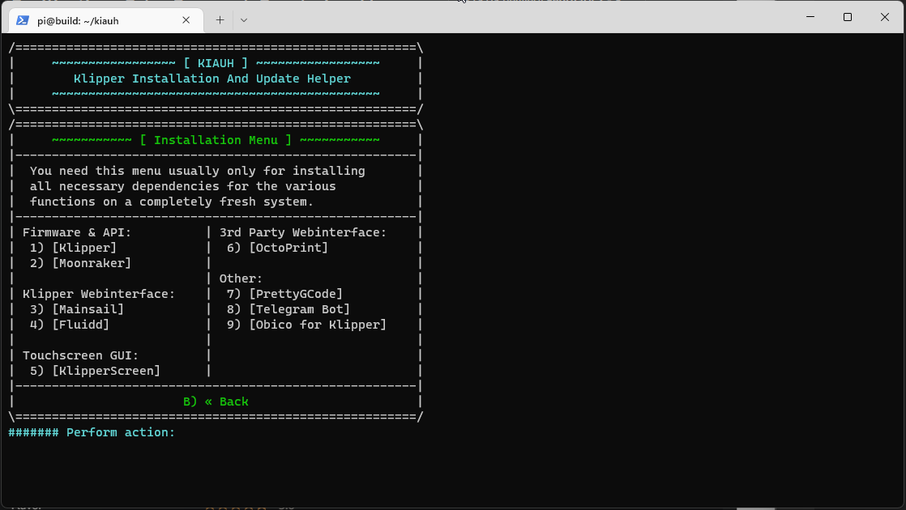
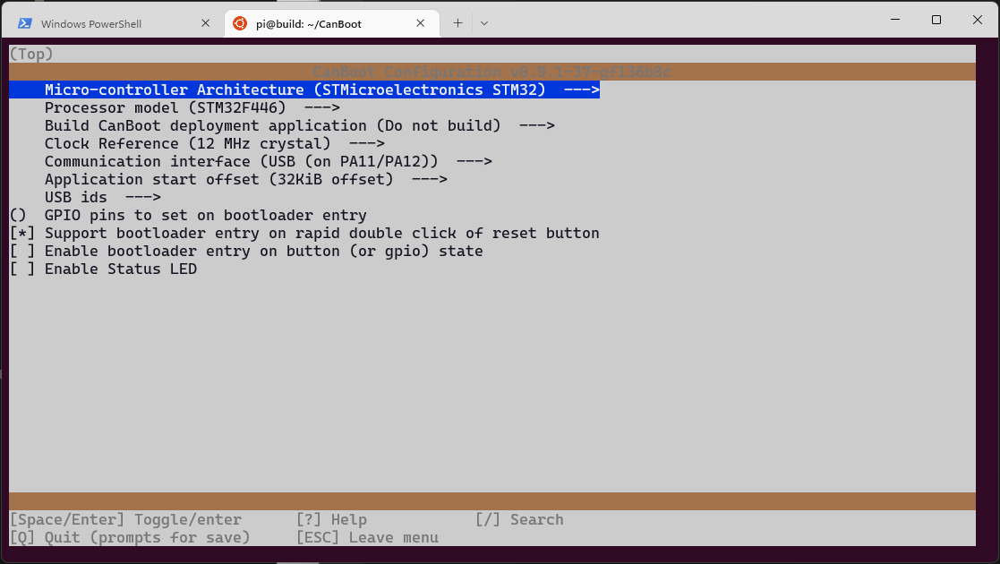
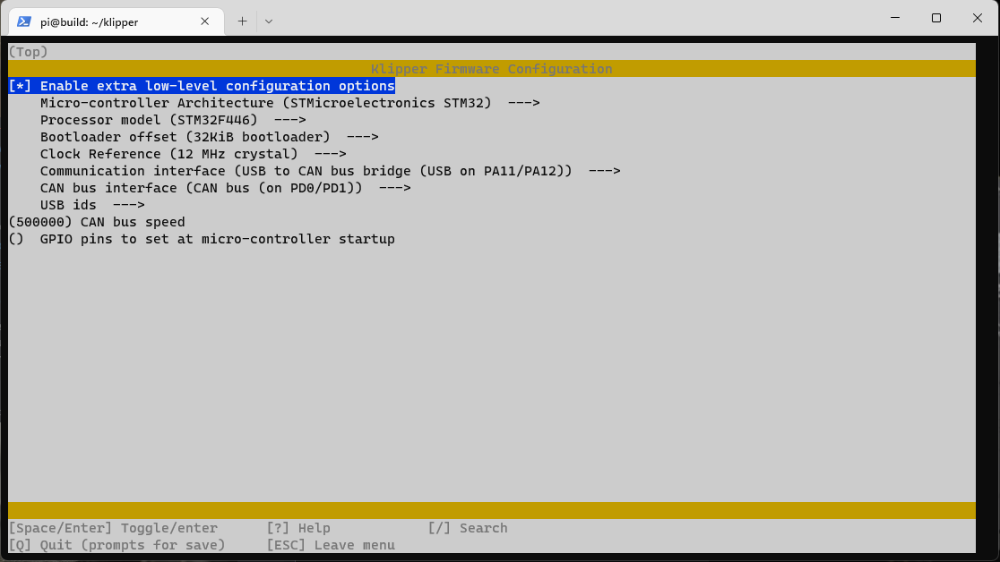

+++
title = "F446xx Can boot With Pass Through"
template = "page.html"
+++

## Dependancies

```bash
sudo apt update
sudo apt upgrade
sudo apt install git

git clone https://github.com/th33xitus/kiauh.git

pip3 install pyserial
```

## Kiauh Configuration
- Choose: option 1 [Install]
## Main menu

## Install Klipper 
- Choose: option 1 [klipper]
- Then follow the prompt


## Installation

```bash
cd ~/
git clone https://github.com/Arksine/CanBoot
cd CanBoot
make menuconfig
```

## Configuration



## Build the firmware

```bash
make clean
make
```

## Flash the Octopus Pro 1.0

```bash
sudo dfu-util -a 0 -D ~/CanBoot/out/canboot.bin --dfuse-address 0x08000000:force:mass-erase:leave -d 0483:df11
```

## Klipper Firmware Config
```bash
cd ~/klipper
make menuconfig
```


```bash
make clean
make
```

## Flash Klipper With CanBoot
```bash
ls /dev/serial/by-id/*
python3 ~/CanBoot/scripts/flash_can.py -f ~/klipper/octopus_klipper.bin -d <serial_device>
```

```bash
sudo nano /etc/network/interfaces.d/can0
```
- Copy and paste the following:
```bash
allow-hotplug can0
iface can0 can static
    bitrate 500000
    up ifconfig $IFACE txqueuelen 128
    pre-up ip link set can0 type can bitrate 500000
    pre-up ip link set can0 txqueuelen 256
 ```
 - Reboot the machine
 ```bash
 sudo reboot
```
- Query the network
```bash
ip addr can0
~/CanBoot/scripts/flash_can.py -i can0 -q
```

- If everything went well you should have a device 
- "OpenMoko, Inc. Geschwister Schneider CAN adapter"
```bash
pi@build:~/klipper $ lsusb
Bus 002 Device 001: ID 1d6b:0003 Linux Foundation 3.0 root hub
Bus 001 Device 003: ID 1d50:606f OpenMoko, Inc. Geschwister Schneider CAN adapter
Bus 001 Device 002: ID 2109:3431 VIA Labs, Inc. Hub
Bus 001 Device 001: ID 1d6b:0002 Linux Foundation 2.0 root hub
```